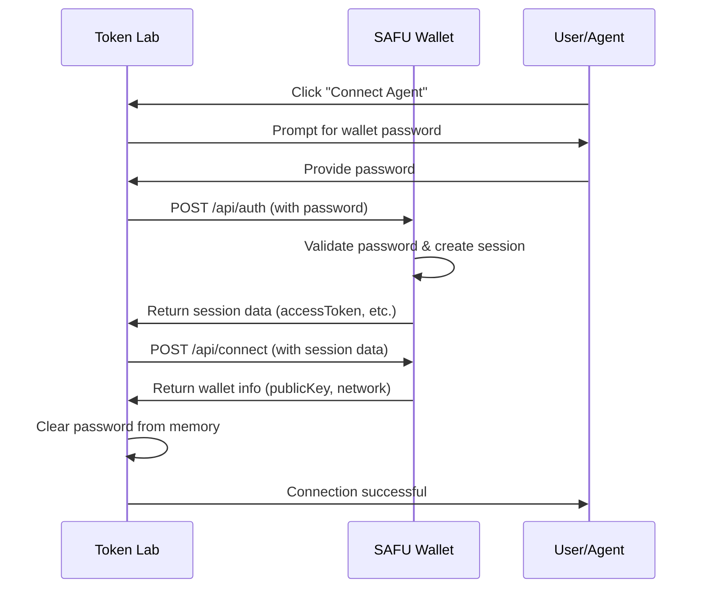

# Connect Agent 2.0 - Authenticated Agent Mode Implementation Guide

This document specifies the secure agent authentication system for SAFU wallet integration with Token Lab. This version requires proper authentication before session access, mirroring the security model of the user interface.

## Overview

Agent Mode 2.0 provides programmatic access to wallet functionality while maintaining the same security standards as interactive user sessions. The key improvement is that agents must authenticate with credentials before accessing session data, just as users must unlock their wallets.

### Security Principles

- ✅ **Authentication Required**: Agents must provide credentials before session access
- ✅ **Session-Based Security**: Creates proper authenticated sessions, not raw access
- ✅ **Credential Protection**: Passwords are never stored, logged, or sent via URLs
- ✅ **Memory Cleanup**: Credentials are cleared from memory after use
- ✅ **Multiple Methods**: API-first with secure browser fallback

## Authentication Flow



## Required API Endpoints

### 1. Authentication Endpoint

**Endpoint**: `POST /api/auth`

**Purpose**: Authenticate agent with wallet password and create session

**Request Body**:
```json
{
  "password": "user_wallet_password",
  "appName": "Token Lab",
  "origin": "http://localhost:3005",
  "mode": "agent"
}
```

**Success Response** (200):
```json
{
  "success": true,
  "accessToken": "jwt_or_session_token",
  "sessionPassword": "session_decryption_key", 
  "encryptedSeed": "encrypted_wallet_seed",
  "publicKey": "wallet_public_key",
  "network": "futurenet",
  "sessionKey": "optional_session_identifier"
}
```

**Error Response** (401):
```json
{
  "success": false,
  "error": "Invalid password"
}
```

**Error Response** (400):
```json
{
  "success": false,
  "error": "Missing required parameters"
}
```

### 2. Enhanced Connection Endpoint

**Endpoint**: `POST /api/connect`

**Purpose**: Establish agent connection using authenticated session

**Request Body**:
```json
{
  "appName": "Token Lab",
  "description": "Programmatic connection for automated deployment",
  "origin": "http://localhost:3005",
  "mode": "agent",
  "accessToken": "authenticated_session_token",
  "sessionPassword": "session_decryption_key",
  "encryptedSeed": "encrypted_wallet_seed"
}
```

**Success Response** (200):
```json
{
  "success": true,
  "publicKey": "GXXXXXXXXXXXXXXXXXXXXXXXXXXXXXXXXXXXXXXXXXXXXXXXXXXXXXXX",
  "network": "futurenet"
}
```

### 3. Enhanced Signing Endpoint

**Endpoint**: `POST /api/sign`

**Purpose**: Sign transactions using authenticated session

**Request Body**:
```json
{
  "transactionXdr": "base64_encoded_xdr",
  "networkPassphrase": "Test SDF Future Network ; October 2022",
  "network": "futurenet",
  "description": "Deploy SEP-41 Token: MyToken (MTK)",
  "appName": "Token Lab",
  "mode": "agent",
  "origin": "http://localhost:3005",
  "accessToken": "authenticated_session_token",
  "sessionPassword": "session_decryption_key",
  "encryptedSeed": "encrypted_wallet_seed"
}
```

**Success Response** (200):
```json
{
  "success": true,
  "signedTransactionXdr": "signed_base64_xdr",
  "transactionHash": "transaction_hash_if_submitted",
  "network": "futurenet",
  "publicKey": "signer_public_key"
}
```

## Browser-Based Authentication Fallback

For cases where the direct API authentication is not available, Token Lab implements a secure browser-based fallback.

### Implementation Requirements

1. **Agent Authentication Mode**: Handle URL parameter `?mode=agent-auth`
2. **PostMessage Communication**: Listen for and respond to authentication requests
3. **Secure Credential Handling**: Never expose credentials in URLs or logs

### PostMessage Protocol

**Incoming Message** (from Token Lab):
```json
{
  "type": "AGENT_AUTH_REQUEST",
  "origin": "http://localhost:3005", 
  "appName": "Token Lab",
  "password": "wallet_password"
}
```

**Success Response** (to Token Lab):
```json
{
  "type": "SAFU_AGENT_AUTH_SUCCESS",
  "payload": {
    "accessToken": "jwt_or_session_token",
    "sessionPassword": "session_decryption_key",
    "encryptedSeed": "encrypted_wallet_seed", 
    "sessionKey": "optional_session_identifier",
    "publicKey": "wallet_public_key"
  }
}
```

**Error Response** (to Token Lab):
```json
{
  "type": "SAFU_AGENT_AUTH_ERROR",
  "message": "Authentication failed: Invalid password"
}
```

### Sample Browser Handler Implementation

```javascript
// In SAFU wallet frontend
window.addEventListener('message', (event) => {
  if (event.origin !== 'http://localhost:3005') return;
  
  if (event.data.type === 'AGENT_AUTH_REQUEST') {
    const { password, appName, origin } = event.data;
    
    try {
      // Authenticate with provided password
      const sessionData = await authenticateUser(password);
      
      // Send success response
      event.source.postMessage({
        type: 'SAFU_AGENT_AUTH_SUCCESS',
        payload: {
          accessToken: sessionData.accessToken,
          sessionPassword: sessionData.sessionPassword, 
          encryptedSeed: sessionData.encryptedSeed,
          sessionKey: sessionData.sessionKey,
          publicKey: sessionData.publicKey
        }
      }, origin);
      
    } catch (error) {
      // Send error response
      event.source.postMessage({
        type: 'SAFU_AGENT_AUTH_ERROR',
        message: `Authentication failed: ${error.message}`
      }, origin);
    }
  }
});
```

## Token Lab Implementation Details

### Authentication Methods

Token Lab supports multiple authentication methods for different use cases:

1. **Interactive Mode**: Prompts user for password via browser dialog
2. **Automation Mode**: Uses pre-configured password from `window.__SAFU_AGENT_PASSWORD__`

### Security Features

- **Memory Cleanup**: Passwords are cleared from memory immediately after use
- **No URL Parameters**: Credentials are never sent via URL parameters
- **Secure PostMessage**: Browser fallback uses encrypted postMessage communication
- **Timeout Handling**: 30-second authentication timeout with automatic cleanup

### Error Handling

Token Lab provides comprehensive error handling and logging:

```
🔐 Connecting to SAFU wallet programmatically...
🔑 Authenticating with provided credentials...
✅ Session established via API
✅ Successfully connected to SAFU wallet (Agent)
Ready for automated deployment!
```

## Testing Workflow

### Manual Testing

1. Start SAFU wallet on `http://localhost:3003`
2. Start Token Lab on `http://localhost:3005`
3. Click "Connect Agent" button in Token Lab
4. Enter wallet password when prompted
5. Verify successful connection and deployment capabilities

### Automated Testing

For CI/CD environments, set the password programmatically:

```javascript
// Before running automated tests
window.__SAFU_AGENT_PASSWORD__ = process.env.SAFU_WALLET_PASSWORD;

// The agent connection will use this automatically
// Password is cleared from memory after use
```

## Security Considerations

### Do Not Store Credentials

- Never store passwords in localStorage, sessionStorage, or any persistent storage
- Clear passwords from memory immediately after use
- Use secure session tokens for subsequent operations

### Validate Origins

- Always validate the origin of postMessage communications
- Only accept connections from authorized Token Lab instances
- Implement CORS policies for API endpoints

### Session Management

- Implement proper session expiration (recommended: 30 minutes)
- Provide session refresh capabilities for long-running operations
- Clear sessions when browser tabs/windows close

### Production Considerations

- Use HTTPS in production environments
- Implement rate limiting on authentication endpoints
- Add audit logging for agent connections
- Consider implementing API keys for server-to-server scenarios

## Migration from Connect Agent 1.0

If you previously implemented the original Connect Agent system:

### Changes Required

1. **Add Authentication**: Implement `/api/auth` endpoint
2. **Update Connect Endpoint**: Accept full session authentication parameters
3. **Update Sign Endpoint**: Accept full session authentication parameters
4. **Add PostMessage Handlers**: For browser-based authentication fallback

### Backward Compatibility

The new system is designed to be backward compatible. If the new authentication endpoints are not available, Token Lab will attempt the browser-based fallback method.

## API Reference Summary

| Endpoint | Method | Purpose | Authentication |
|----------|--------|---------|----------------|
| `/api/auth` | POST | Authenticate agent with password | Password required |
| `/api/connect` | POST | Establish agent connection | Session data required |
| `/api/sign` | POST | Sign transactions | Session data required |

## Support and Troubleshooting

### Common Issues

1. **"Authentication failed"**: Verify wallet password is correct
2. **"Missing required parameters"**: Ensure all authentication fields are provided
3. **"Origin not authorized"**: Check CORS settings and origin validation
4. **"Session expired"**: Re-authenticate to establish new session

### Debug Logging

Enable verbose logging in Token Lab to diagnose authentication issues:

```
[14:56:21] 🔐 Connecting to SAFU wallet programmatically...
[14:56:21] 🔑 Authenticating with provided credentials...
[14:56:22] ✅ Session established via API
[14:56:22] ✅ Successfully connected to SAFU wallet (Agent)
```

## Agent Monitoring & Observability

### Token Lab UI Monitoring

The primary way to monitor agent activities is through the Token Lab interface:

#### 1. **Real-Time Logs Section**
All agent actions are logged in real-time with special indicators:

```
[14:56:21] 🤖 [AGENT] ✅ Connecting to SAFU wallet programmatically...
[14:56:22] 🤖 [AGENT] ✅ Using pre-configured credentials for automation
[14:56:23] 🤖 [AGENT] ✅ Session established via API
[14:56:24] 🤖 [AGENT] ✅ Successfully connected to SAFU wallet (Agent)
[14:56:25] 🤖 [AGENT] ℹ️ Signing transaction programmatically with agent...
[14:56:26] 🤖 [AGENT] ✅ Transaction signed successfully!
```

**Key Features:**
- `🤖 [AGENT]` prefix clearly identifies agent actions
- Timestamps for precise activity tracking
- Color-coded status indicators (✅ success, ❌ error, ⚠️ warning, ℹ️ info)
- Automatic log retention (latest 250 entries)

#### 2. **Agent Status Indicator**
When connected in agent mode, a blue status badge appears next to the wallet connection:

```
✅ GA7IF0GH...UDOALZI6    🤖 AGENT MODE
                         Programmatic control active
```

#### 3. **Operation Differentiation**
Agent operations are clearly distinguished from manual operations:
- Agent deployments: `🤖 Signing transaction programmatically with agent...`
- Manual deployments: `🔐 Opening wallet popup for user confirmation...`

### Console Monitoring

For programmatic monitoring, all agent actions are also logged to the browser console:

```javascript
[TOKEN_LAB_AGENT] 14:56:21 - Connecting to SAFU wallet programmatically...
[TOKEN_LAB_AGENT] 14:56:22 - Authentication successful
[TOKEN_LAB_AGENT] 14:56:23 - Transaction signed successfully
```

**Access via Browser DevTools:**
1. Open DevTools (F12)
2. Go to Console tab
3. Filter by `TOKEN_LAB_AGENT` to see only agent activities

### Monitoring Methods by Use Case

#### **Interactive Development**
- **Primary**: Token Lab UI logs section
- **Secondary**: Browser console for detailed debugging
- **Best for**: Real-time development and testing

#### **Automated Testing**
```javascript
// Monitor agent activities programmatically
const originalConsoleLog = console.log;
const agentLogs = [];

console.log = function(...args) {
  if (args[0] && args[0].includes('[TOKEN_LAB_AGENT]')) {
    agentLogs.push(args.join(' '));
  }
  originalConsoleLog.apply(console, args);
};

// Your agent operations here...

// Analyze logs
console.log('Agent performed', agentLogs.length, 'operations');
```

#### **CI/CD Integration**
```javascript
// Set up monitoring for CI environment
window.__SAFU_AGENT_PASSWORD__ = process.env.SAFU_WALLET_PASSWORD;

// Monitor for completion
const waitForAgentCompletion = () => {
  return new Promise((resolve, reject) => {
    const checkLogs = () => {
      const logs = document.querySelectorAll('[data-log-entry]');
      const lastLog = logs[logs.length - 1]?.textContent || '';
      
      if (lastLog.includes('🤖 [AGENT] ✅') && lastLog.includes('deployment')) {
        resolve('Agent deployment completed successfully');
      } else if (lastLog.includes('🤖 [AGENT] ❌')) {
        reject(new Error('Agent operation failed'));
      } else {
        setTimeout(checkLogs, 1000);
      }
    };
    checkLogs();
  });
};
```

### Log Message Categories

#### **Connection & Authentication**
```
🤖 [AGENT] ✅ Connecting to SAFU wallet programmatically...
🤖 [AGENT] ✅ Using pre-configured credentials for automation  
🤖 [AGENT] ✅ Session established via API
🤖 [AGENT] ✅ Successfully connected to SAFU wallet (Agent)
```

#### **Transaction Operations**
```
🤖 [AGENT] ℹ️ Signing transaction programmatically with agent...
🤖 [AGENT] ✅ Transaction signed successfully!
🤖 [AGENT] ℹ️ Submitting WASM upload to Futurenet...
🤖 [AGENT] ✅ Token deployed successfully
```

#### **Error Handling**
```
🤖 [AGENT] ❌ Authentication failed: Invalid password
🤖 [AGENT] ❌ Transaction signing failed: Network error
🤖 [AGENT] ⚠️ API authentication failed, trying browser method
```

### Advanced Monitoring Features

#### **Log Export**
```javascript
// Export agent logs for analysis
function exportAgentLogs() {
  const logs = Array.from(document.querySelectorAll('[data-log-entry]'))
    .map(el => el.textContent)
    .filter(log => log.includes('🤖 [AGENT]'));
  
  const blob = new Blob([logs.join('\n')], { type: 'text/plain' });
  const url = URL.createObjectURL(blob);
  
  const a = document.createElement('a');
  a.href = url;
  a.download = `agent-logs-${new Date().toISOString()}.txt`;
  a.click();
}
```

#### **Performance Monitoring**
```javascript
// Track agent operation timing
const agentMetrics = {
  connectionTime: 0,
  deploymentTime: 0,
  operationCount: 0
};

// This data is available in browser performance timeline
performance.mark('agent-start');
// ... agent operations ...
performance.mark('agent-end');
performance.measure('agent-operation', 'agent-start', 'agent-end');
```

### Troubleshooting with Logs

#### **Common Patterns to Watch For**

1. **Successful Agent Flow**:
   ```
   🤖 [AGENT] ✅ Connecting → Authentication → Session → Deploy → Success
   ```

2. **Authentication Issues**:
   ```
   🤖 [AGENT] ❌ Authentication failed: Invalid password
   🤖 [AGENT] ⚠️ API authentication failed, trying browser method
   ```

3. **Network/API Issues**:
   ```
   🤖 [AGENT] ❌ Connection failed: Bad Request
   🤖 [AGENT] ℹ️ Make sure SAFU wallet is running at localhost:3003
   ```

#### **Debug Mode**
Enable verbose logging by setting:
```javascript
window.__SAFU_DEBUG_MODE__ = true;
```

This will show additional internal state information in the logs.

### Best Practices for Monitoring

1. **Always Monitor**: Keep the Token Lab logs visible during agent operations
2. **Log Retention**: Important logs are kept for 250 entries (about 30-60 minutes of activity)
3. **Error Investigation**: Check both Token Lab logs and browser console for complete error context
4. **Performance Tracking**: Use browser DevTools Performance tab for detailed timing analysis
5. **Automated Monitoring**: In CI/CD, capture and analyze log patterns for success/failure detection

For SAFU wallet implementation questions or issues, please refer to the Token Lab team or create an issue in the Token Lab repository.